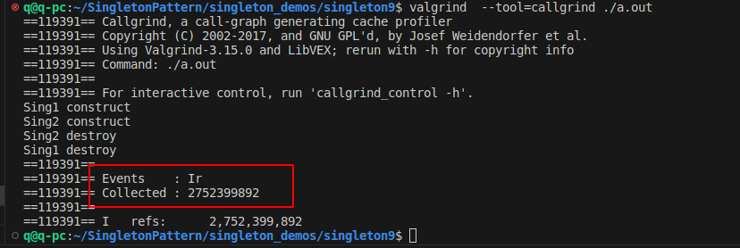

##  0.引言

某网课笔记。


主要内容：
- 了解单例模式
- 对 C++ 语法的综合性应用
- 了解 static initialization order fiasco 与 C++ 标准流的初始化细节

单例介绍：
- 保证一个类仅有一个实例，并提供一个访问它的全局访问点。（引用自《设计模式》）
-  “公告栏” 式的功能。与之相对应的是层层传递的信息传递方式，不太好，不好修改扩展。软件编写思想很多都是来源于生活。


实现目标：
- 无需显式提供参数的初始化
 - 如果不希望用户按照某种方式使用，那么应想方法明确禁止（尽量不要列于文档中）
 - 如果希望用户按某种方式使用，那么应设计得尽量高效，至少对于大部分常用接口如此


对于将讨论的九次实现（改进）： 
- 每个实现都会在原有实现基础上进行优化，解决原有实现的问题
- 优化有的简单，有的复杂
- 每次讨论中都会包含问题，欢迎思考
- 并非每个实现都足够健壮可用
- 实现可能存在 Bug，欢迎讨论
- 可能存在更好的实现，欢迎讨论


##  1.第一品


- 基本思路：使用面向对象的方式对要访问的数据进行封装
- 优点：符合基本的面向对象编程方法
    - 使用类对单例中的内容进行封装
    - 使用类的构造函数初始化数据成员，析构函数释放资源
- 缺点
    - 完全没有阻止用户构造该类的多个对象


##  2.第二品
- 基本思路
    - 将构造、析构函数设置为私有成员
    - 使用静态成员函数获取唯一的实例
- 优点
    - 可以防止用户不小心构造新的实例
    - （C++11 开始）系统会保证函数内部的静态成员初始化是多线程安全的
- 特点
    - 缓式初始化（lazy initialization）,首次访问时构造，否则就不构造；可能是优点有可能是缺点。偏向于是缺点，一般情况下写了单例后基本上是会使用的，在使用时构造可能就会涉及资源调度等穿插行为，会干扰系统的性能。
- 缺点
    - 没有完全阻止用户构造该类的多个对象


```c
#pragma once
#include <iostream>

class Sing {
 public:
  static const Sing& Instance() {
    static Sing inst;
    return inst;
  }

 private:
  Sing() {
    std::cout << "Sing construct\n";
    val = 100;
  }
  ~Sing() { std::cout << "Sing destroy\n"; }

 public:
  int val;
};
```

```c
#include "sing.h"

int main(int argc, char **argv) {
  std::cout << "get value: " << Sing::Instance().val << '\n';

  // 缺点： 没有完全阻止用户构造该类的多个对象
  // new sing 执行构造函数，构造函数传入一个对象的引用,相当于调用了一个拷贝构造函数
  // Sing类里面只定义了普通构造函数，没有定义拷贝构造函数,此时编译器会为类合成一个拷贝构造函数且为public的
  Sing *sing2 = new Sing(Sing::Instance());
  // 在堆上构造，通常是显示销毁，如果不指定就不会销毁，因此不会调用析构函数，是合法可编译的


// Sing(Sing::Instance());
// 这样构造一个临时对象是不行的，分配在栈上，生命周期结束时需要调用析构函数进行销毁，但是析构函数是私有的，无法调用，因此编译出错
}
```


##  3.第三品（常见实现，可用）
- 基本思路
    - 通过限制拷贝（移动）构造，拷贝（移动）赋值进一步杜绝非法复制
- 优点
    - 杜绝构造新的实例
- 缺点
    - 由于多线程安全所引入的额外成本

```c
#pragma once
#include <iostream>

class Sing {
 public:
  static const Sing& Instance() {
    // 缺点：由于多线程安全所引入的额外成本,都要求对类进行加锁以保证线程安全
    // 不管是读还是写，都需要先加锁判断是否已经存在实现
    // 实际上，读操作可以不加锁就是安全的
    static Sing inst;
    return inst;
  }

 private:
  Sing() {
    std::cout << "Sing construct\n";
    val = 100;
  }

  ~Sing() { std::cout << "Sing destroy\n"; }
  // 对于第二品的改进，限制拷贝（移动）构造，拷贝（移动）赋值进一步杜绝非法复制
  // 如果声明了拷贝构造函数，而没有声明移动构造函数时；当我们要涉及移动构造时，系统会尝试调用拷贝构造，因此这里只限制拷贝构造也就相当于限制了移动构造
  Sing(const Sing&) = delete;
  Sing& operator=(const Sing&) = delete;

 public:
  int val;
};
```

```c
#include "sing.h"

int main(int argc, char** argv) {
  std::cout << "get value: " << Sing::Instance().val << '\n';
  // 无法通过编译
  // Sing* s = new Sing(std::move(Sing::Instance()));

  /*size_t res = 0;
  for (unsigned i = 0; i < 999999999; ++i)
  {
      res += Sing::Instance().val + i;
  }
  return res;*/
}

// get value: Sing construct
// 100
// Sing destroy
```


##  4.第四品
- 基本思路
    - 引入全局对象，区分单例的初始化与调用
    - 静态函数用于初始化；全局对象用于后续调用
- 优点
    - 减少了调用所付出的成本
- 特点
    - 热初始化（eager initialization）
- 缺点
    - static initialization order fiasco 问题，程序存在较大隐患


ms 和 sm 有什么区别呢？唯一的区别就是链接文件顺序有变化，为什么呢？

C++对全局对象的初始化顺序规定不是很严格，对于两个翻译单元（string、main）中的全局对象，谁先谁后的问题，没有严格定义；此时就可能是singletonInst2先初始化，导致段错误。


改为指针：


由于存在`static initialization order fiasco` 问题，**第四品是不可使用的。**第三品没这个问题，顺序是固定的。


##  5.第五品

- 基本思路
    - 引入初始化类
    - 初始化类是单例类的子类，可以访问单例类的所有成员
    - 通过初始化类的实例作为纽带，一定程度上控制初始化顺序
- 优点
    - 初始化类可以精确控制初始化时机
- 缺点
    - 似乎可以解决 static initialization order fiasco 问题，但实际上程序包含了更深层次的隐患：可能出现未定义的行为。


// 结果不再依赖链接顺序：


似乎解决了，但也存在隐患，**第五品不可用。**


之前讲的全局变量，同一翻译单元中，先定义就先初始化；再具体的讲`Type x;`对于这个定义有两种情况：
- 定义的对象能够在编译期进行求值，同时编译期决定要对当前对象进行求值，此时系统就会在编译期间进行求值，期间相关的计算结果会保留到编译完的可执行程序中，加载可执行程序的时候会直接将数值加载到内存里，然后将这块内存与变量相关联 ==> 常量初始化
- 定义的对象能够在编译期进行求值，但编译期拒绝对当前对象进行求值，或该对象本身不能在编译期进行求值；此时系统就会将该数据类型占据内存大小的信息保留到可执行程序中，加载可执行程序的时候会根据该信息进行内存开辟，同时将内存中的数值全部置为0； ==> 0初始化； 0初始化后再进行计算初始化


main  sing 链接顺序时：
- main.cpp中 全局变量 static Sing::Init init; （对 singletonInst 进行赋值）auto singletonInst2 = singletonInst->val;【这里还涉及到一个先调用后构造的未定义行为，在main函数先翻译时，singletonInst是为定义的
- sing.cpp中 全局变量 MyUniquePtr<Sing> singletonInst; // MyUniquePtr 的构造函数执行的是 0 初始化 + 缺省初始化； singletonInst 为 “0”，因此出现段错误


sing main 连接顺序时：
- sing.cpp中 全局变量 MyUniquePtr<Sing> singletonInst; // MyUniquePtr 的构造函数执行的是 0 初始化 + 缺省初始化； singletonInst 为 “0”
- main.cpp中 全局变量 static Sing::Init init; （对 singletonInst 进行赋值）auto singletonInst2 = singletonInst->val;

纠错办法为，将 MyUniquePtr 的构造函数改为编译期执行，即加上关键字 `consteval` 或 `constexpr`

```c
template <typename T>
class MyUniquePtr : public std::unique_ptr<T> {
 public:
// consteval 
constexpr
  MyUniquePtr() : std::unique_ptr<T>() {}
};
```


##  6.第六品
- 基本思路1——强制编译期初始化
    - constinit / consteval  都是C++20的关键字，对应的代码在singleton5_1 中；不能使用 constexpr 会被指定为常量无法再进行更改。
- 基本思路2——运行期平凡缺省初始化；对应代码在 singleton6 中
    - 使用基本数据类型代替抽象数据类型作为全局对象
    - 通过引用计数控制销毁时机
- 优点
    - 全局对象平凡初始化
    - 同时精确控制初始化与销毁
- 缺点
    - 多线程不安全


##  7.第七品
- 基本思路
    - 为引用计数引入线程安全操作
- 优点
    - 全局对象初始化/销毁多线程安全
- 缺点
    - 指针有被修改的风险

缺点：


##  8.第八品（可用）
- 基本思路
    - 使用引用代替指针
    - 方法1：将原始指针封装到类内部，使用函数提供引用接口
    - 方法2：使用 placement new
- 优点
    - 避免指针赋值而产生的问题
- 缺点
    - 代码组织相对复杂，不易扩展


##  9.第九品（可用）
- 基本思路
    - 对单例类的功能逻辑与单例逻辑进行划分，分别放入不同的部分
    - 使用CRTP模拟“基类-派生类”行为
- 优点
    - 更容易支持不同的单例实例
    - 使用模板不会引入运行期成本
- 缺点
    - 暂无


##  10.评注


- 第三品与第九品的性能对比

`sudo apt  install valgrind  # version 1:3.15.0-1ubuntu9.1`

- `g++ -O3 ./main.cpp`


- `/usr/bin/time ./a.out` 简单测试程序运行的时间
- `valgrind  --tool=callgrind ./a.out` 测试程序运行时，运行了多少机器指令


第九品测试结果：





第三品测试结果：

```bash
g++ -O3 ./main.cpp
/usr/bin/time ./a.out
valgrind  --tool=callgrind ./a.out
```


显然，第九品更优。


- C++ 标准 IO 流的实现方式
    - [ios_base::init 类](https://en.cppreference.com/w/cpp/io/ios_base/Init)
    - [GCC 的实现示例](https://github.com/gcc-mirror/gcc/blob/master/libstdc++-v3/src/c++98/ios_init.cc#L85)

- 如果在实现 单例A 的逻辑时：
    - 部分实现逻辑在源文件而非头文件中
    - 源文件中的逻辑使用了 单例B 的内容
    - 那么一定要将 单例B 的头文件置于 单例A 的头文件中